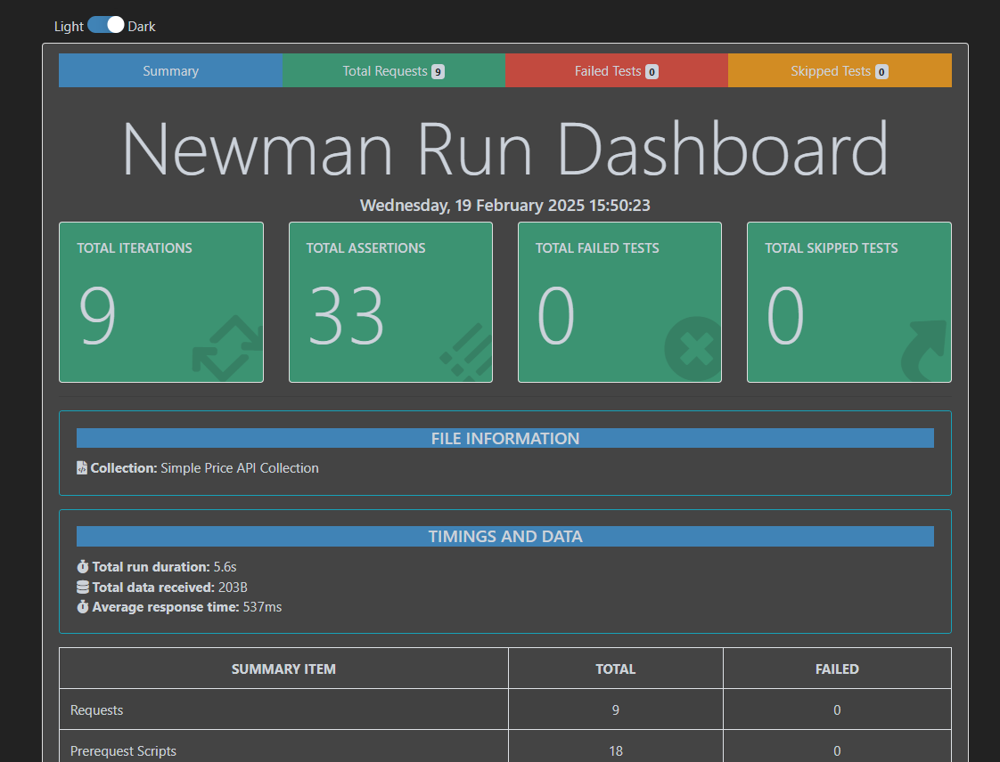

# CoinGecko API Testing  

This project contains automated API tests for the **CoinGecko Simple Price API** endpoint. The tests validate functionality, error handling, performance, and data accuracy using **Postman, Newman, and JavaScript**.

---

## 🚀 **Project Overview**  

- **API Under Test**: `GET /simple/price?ids=ethereum&vs_currencies=usd`  
- **Automation Tools**: Postman, Newman  
- **CI/CD Integration**: GitHub 
- **Performance Testing**: K6  

---

## 📌 **Prerequisites**  

1. **Install Node.js** (if not installed)  
   - Download from: [https://nodejs.org/](https://nodejs.org/)  
   - Verify installation:  
     ```sh
     node -v
     npm -v
     ```
   
2. **Install Newman (Postman CLI Runner)**  
   ```sh
   npm install -g newman newman-reporter-htmlextra


## 📌 ** API Test Execution & Reports **

1. **Run Command for test execution**  
   ```sh
    newman run postman_collection/simplepriceapi.postman_collection.json -d test_data/test_cases.json --reporters cli -r htmlextra --reporter-htmlextra-export newman-report.html

   
2. **View test execution results**  
   ```sh
    start newman-report.html  # Windows
   

3. **Result screenshot**


   


## 📌 ** Load & Stress Testing **

1. **Run Command for load testing**
   ```sh
     k6 run load_testing/load_test.js
2. For Stress testing Increase load to 2 requests/sec into [load_test.js](load_testing/load_test.js)

## 📌 ** Security Testing **

1. **Install Mocha, Chai, and Supertest **
   ```sh
     npm install mocha chai supertest 
   
2. **Run Command for Security testing**
   ```sh
     npx mocha .\security_testing\sql_injection.js